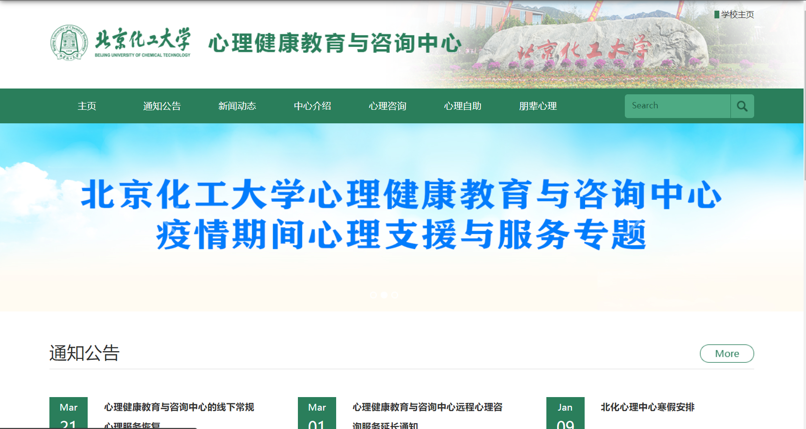

# 心理服务
## 北京化工大学心理健康教育与咨询中心
介绍：北京化工大学心理健康教育与咨询中心（原心理咨询室，始创于1992年），现隶属于北京化工大学学生工作办公室，是面向全校学生开展心理健康教育与免费心理咨询的教育服务型机构。中心运用心理学原理和方法，帮助同学们对学习和生活中遇到的问题进行认识、反思和调节，促进个性的发展及潜能的开发，以更好地适应未来社会对高素质人才的需求。  

网站：[https://xinli.buct.edu.cn](https://xinli.buct.edu.cn)  

中心地址：科技大厦315（东校区）、后勤服务楼F座401、403、405（昌平校区）  

联系电话：64413344（东校区）、80191025（昌平校区）  

预约服务：  
① 电话预约，拨打64413344（东校区）、80191025（昌平校区）即可预约服务。  
②现场预约。 

[了解更多心理中心咨询老师](https://mp.weixin.qq.com/s/mGM27Qy7oHTIs-aYsb0czA)。

**撰稿人：陈梁辉**

**审核人：田福利**
